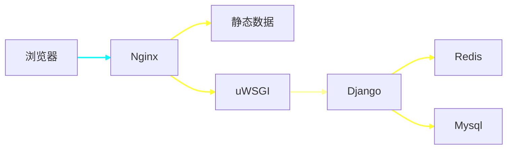
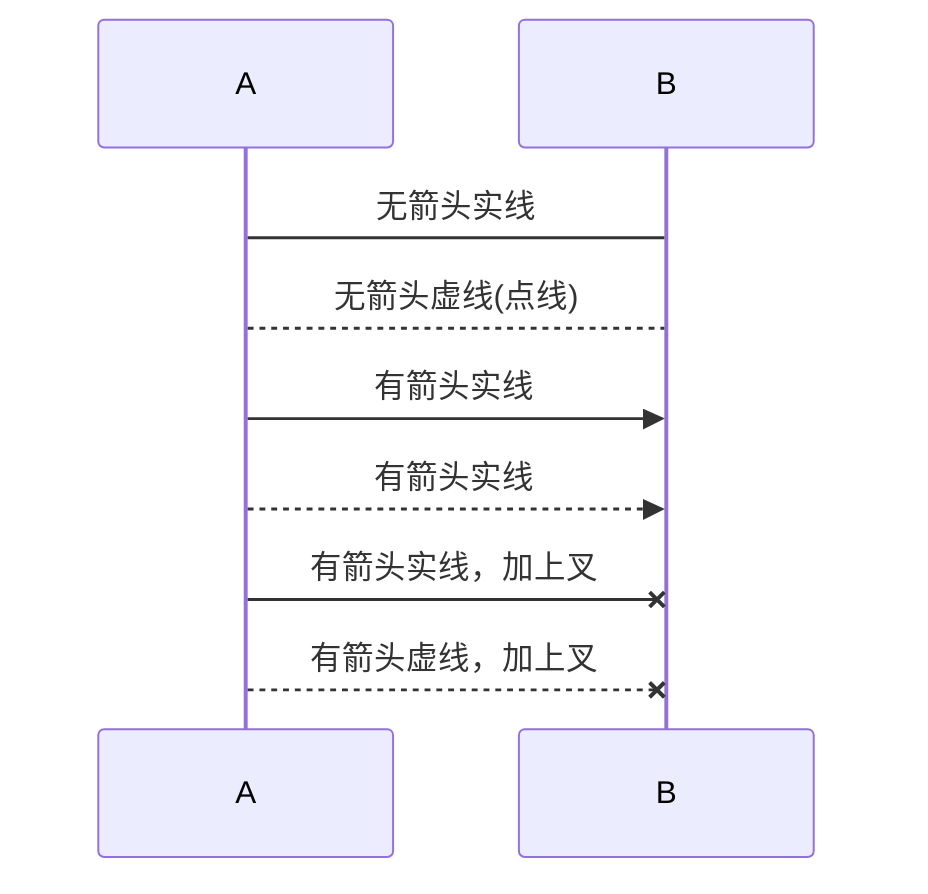

[TOC]

# Docker

docker跟虚拟机的区别


> docker相比与虚拟机的优势
>
> `更快速的交付和部署`
>
> ~~~
> 测试开发上线运维一条龙.
> ~~~
>
> `高效的部署和扩容`
>
> ~~~
> 跨平台性强,不管虚拟机上面,还是服务器,或者云上面.都能快速部署.不过对windows不太友好
> ~~~
>
> `更高的资源利用率`
>
> ~~~
> 不需要虚拟机,所以节省了很多资源,启动运行基本上都是秒级的
> ~~~
>
> `更简单的管理`
>
> ~~~
> 因为是c/s架构可以使用客户端或者restful管理容器
> ~~~

### 原理

> 1.Docker是依赖于Linux内核特性:Namespace和cgroup
>
> ~~~
> 所以操作系统只能运行在相同或相似的内核的操作系统
> ~~~
>
> 2.Docker容器的能力
>
> ~~~
> 文件系统隔离:每个容器都有自己的root文件系统
> 
> 进程隔离:每个容器都运行在自己的进程环境中
> 
> 网络隔离:容器间的虚拟网络接口和IP地址都是分开的
> 
> 资源隔离和分组隔离:使用cgroup讲cpu和内存之类的资源独立分配给每个Docker容器
> ~~~
>
> 3.cgoup的作用
>
> ~~~
> 资源限制
> 
> 优先级设定
> 
> 资源计量
> 
> 资源控制
> ~~~


基本概念:

+ Docker 是一个`客户端-服务端(C/S)`架构程序。

+ Docker 包括三个基本概念:

  + 镜像（Image）

    > Docker的镜像概念类似于虚拟机里的镜像，是一个只读的模板，一个独立的文件系统，包括运行容器所需的数据，可以用来创建新的容器。

  + 容器（Container）

    > Docker容器是由Docker镜像创建的运行实例，类似VM虚拟机，支持启动，停止，删除等。
    >
    > 每个容器间是相互隔离的，容器中会运行特定的应用，包含特定应用的代码及所需的依赖文件。

  + 仓库（Repository）

    > Docker的仓库功能类似于Github，是用于托管镜像的。

### Docker操作

~~~shell
# 启动docker
$ sudo service docker start
# 重启docker
$ sudo service docker restart
# 停止docker
$ sudo service docker stop
~~~

###  Docker镜像操作

**查看镜像**

```bash
sudo docker image ls
```


**拉取镜像**

~~~bash
# 官方镜像
$ sudo docker image pull 镜像名称 或者 sudo docker image pull library/镜像名称
$ sudo docker image pull ubuntu 或者 sudo docker image pull library/ubuntu
$ sudo docker image pull ubuntu:16.04 或者 sudo docker image pull library/ubuntu:16.04

# 个人镜像
$ sudo docker image pull 仓库名称/镜像名称
$ sudo docker image pull itcast/fastdfs
~~~

**删除镜像**

~~~bash
$ sudo docker image rm 镜像名或镜像ID
$ sudo docker image rm hello-world
$ sudo docker image rm fce289e99eb9
~~~

### Docker容器操作

**查看容器**

```bash
# 查看正在运行的容器
$ sudo docker container ls
# 查看所有的容器
$ sudo docker container ls --all
```

**创建容器**

```bash
$ sudo docker run [option] 镜像名 [向启动容器中传入的命令]
交互式
$ sudo docker run -it --name=ubuntu1 ubuntu /bin/bash
# 守护式容器(常用)
$ sudo docker run -dit --name=ubuntu2 ubuntu
#如果对于一个需要长期运行的容器来说，我们可以创建一个守护式容器。在容器内部执行 exit 命令退出时，该容器也随之停止。
```

```
常用可选参数说明：
* -i 表示以《交互模式》运行容器。
* -t 表示容器启动后会进入其命令行。加入这两个参数后，容器创建就能登录进去。即分配一个伪终端。
* --name 为创建的容器命名。
* -v 表示目录映射关系，即宿主机目录:容器中目录。注意:最好做目录映射，在宿主机上做修改，然后共享到容器上。 
* -d 会创建一个守护式容器在后台运行(这样创建容器后不会自动登录容器)。 
* -p 表示端口映射，即宿主机端口:容器中端口。
* --network=host 表示将主机的网络环境映射到容器中，使容器的网络与主机相同。
```

**使用容器程序**

```bash
$ sudo docker exec -it 容器名或容器id 进入后执行的第一个命令
$ sudo docker exec -it ubuntu2 /bin/bash
```

**停止和启动容器**

```bash
# 停止容器
$ sudo docker container stop 容器名或容器id
# kill掉容器
$ sudo docker container kill 容器名或容器id
# 启动容器
$ sudo docker container start 容器名或容器id
```

**删除容器**

```bash
$ sudo docker container rm 容器名或容器id
```

> ~~~
> 如果要删除一个镜像
> 1.停掉容器
> 2.删除容器
> 3.删除掉镜像
> ~~~

**自定义容器制作成镜像**

```bash
# 将容器制作成镜像
$ sudo docker commit 容器名 镜像名
# 镜像打包备份
$ sudo docker save -o 保存的文件名 镜像名
# 镜像解压
$ sudo docker load -i 文件路径/备份文件
```

# FastDFS

**FastDFS概念**

~~~
1.用c语言编写的一款开源的轻量级分布式文件系统。
2.功能包括：文件存储、文件访问（文件上传、文件下载）、文件同步等，解决了大容量存储和负载均衡的问题
3.为互联网量身定制，充分考虑了冗余备份、负载均衡、线性扩容等机制，并注重高可用、高性能等指标
~~~


+ **Client**： 客户端，业务请求的发起方，通过专有接口
+ **Tracker server**：跟踪服务器，主要做调度工作，起负载均衡的作用

+ **Storage server**：存储服务器（存储节点或数据服务器），文件和文件属性都保存到存储服务器上。Storage server直接利用OS的文件系统调用管理文件。Storage群中的横向可以扩容，纵向可以备份。

**Docker安装运行FastDFS**

+ **获取FastDFS镜像**

~~~bash
# 从仓库拉取镜像
$ sudo docker image pull delron/fastdfs
# 解压教学资料中本地镜像
$ sudo docker load -i 文件路径/fastdfs_docker.tar
~~~

+ **开启tracker容器**

~~~ bash
#我们将 tracker 运行目录映射到宿主机的 /var/fdfs/tracker目录中。
$ sudo docker run -dit --name tracker --network=host -v /var/fdfs/tracker:/var/fdfs delron/fastdfs tracker
~~~

+ **开启storage容器**

~~~bash
# TRACKER_SERVER=Tracker的ip地址:22122（Tracker的ip地址不要使用127.0.0.1）
# 我们将 storage 运行目录映射到宿主机的 /var/fdfs/storage目录中。
$ sudo docker run -dti --name storage --network=host -e TRACKER_SERVER=192.168.103.210:22122 -v /var/fdfs/storage:/var/fdfs delron/fastdfs storage

~~~

+ **事例**

~~~python
from fdfs_client.client import Fdfs_client


# 1.创建fdfs客户端实例对象
fdfs_client = Fdfs_client('client.conf')

# 2.上传
ret = fdfs_client.upload_by_filename('/Users/chao/Desktop/kk02.jpeg')
f = open('/Users/chao/Desktop/kk02.jpeg', 'r')
# content = f.read()
# fdfs_client.upload_by_buffer(content)


print(ret)
# {
# 'Group name': 'group1',
# 'Remote file_id': 'group1/M00/00/00/wKhn0l1WWTGAKNrkAAC4j90Tziw37.jpeg',
# 'Status': 'Upload successed.',
# 'Local file name': '/Users/chao/Desktop/01.jpeg',
# 'Uploaded size': '46.00KB',
# 'Storage IP': '192.168.103.210'}
~~~

# Vim

| 末行模式命令       | 功能            |
| ------------------ | --------------- |
| :w                 | 保存            |
| :wq                | 保存退出        |
| :x                 | 保存退出        |
| :q!                | 强制退出        |
| **vim 的常用命令** | **功能**        |
| yy                 | 复制光标所在行  |
| p                  | 粘贴            |
| dd                 | 删除/剪切当前行 |
| u                  | 撤销            |
| :/搜索的内容       | 搜索指定内容    |
| G                  | 回到最后一行    |
| gg                 | 回到第一行      |
| 数字+G             | 回到指定行      |


> ~~~
> RPC简称为远程调用.有很多的具体实现.grpc就是其中一款
> ~~~

**第一步**

> **编写Protocol Buffers文档**
>
> ~~~
> syntax = "proto3";	//申明使用的语法版本
> 
> // 请求参数的消息类型
> message UserRequest {
> 		string user_id=1; // 用户id 1代表第一个参数
> 		int64 channel_id=2; // 频道id
> 		int64 article_num=3; // 推荐的文章数量
> 		int64 time_stamp=4; // 推荐的时间戳
> 
> }
> 
> 
> 
> message Track {
>  			  string click=1; // 用户点击行为的埋点参数
>  			  string collect=2; // 用户收藏的埋点参数
>  			  string share=3; // 用户分享的埋点参数
>  			  string read=4; // 用户进入文章详情的埋点参数
>  }
> 
>  message Article {
>  				int64 article_id=1; // 推荐文章的id值
>  				Track track=2; // 文章埋点数据
> 
>  }
> 
>  // 推荐文章的响应消息数据
>  message ArticleResponse {
>  			string exposure=1; // 曝光数据
>  			int64 time_stamp=2; // 推荐文章时间戳
>  			repeated  Article  recommends=3; // 推荐文章结果列表
>  }
> 
> 
>  // 用户推荐文章的具体服务
>  service UserArticleRecommend {
> 		rpc user_recommend(UserRequest) returns (ArticleResponse) {}
>  }
> ~~~

**第二步**

> **编译生成代码**
>
> ~~~
> # 在Protocol Buffers文档同级目录执行命令,
> python -m grpc_tools.protoc -I. --python_out=. --grpc_python_out=. reco.proto
> 最后面的reco.proto是需要编译的文件名
> ~~~
>
> **编译完成后会生成两个文件**
>
> ~~~
> reco_pb2.py和reco_pb2_grpc.py
> # 两个文件名由原文件拼接出来的:原文件_pb2.py或者,原文件_pb2_grpc.py
> ~~~
>
> reco_pb2.py
>
> ~~~ 
> 此文件相当于一个模型类文件一样.
> ~~~
>
> reco_pb2_grpc.py
>
> 此文件有三个类
>
> server使用下面两个类
>
> UserArticleRecommendServicer-----> 定义需要接受的服务,需要继承修改
>
> add_UserArticleRecommendServicer_to_server----->把服务添加的服务器中去
>
> client使用上面一个类
>
> UserArticleRecommendStub
>
> 此类用于获取助手对象

~~~sequence
alice->Bob:nihaome 
Bob-->alice:sdjs
~~~



```javascript

```




# Elasticsearch

> ~~~
> Elasticsearch主要实现了三件事：
> 1.全文检索
> 2.数据分析
> 3.分布式
> ~~~

~~~mermaid
graph LR
Lucene-->Elasticsearch


~~~

> Lucene的特点
>
> ~~~
> 介绍:
> 	1.基于java实现的，
> 	2.世界上最优秀的搜索库
> 优点:
> 	1.全文检索
> 	2.倒排索引
> 缺点:
> 	1.分布式实现复杂(通信成本高)-->单机应用
> 	2.API比较复杂
> 	3.数据安全性没办法得到保证
> ~~~
>
> Elasticsearch
>
> ~~~
> 介绍:
> 	1.Elasticsearch继承了Lucene的优势
> 	2.弥补了Lucene的劣势
> 有点:
> 	1.实现了分布式，
> 	2.数据的备份,
> 	3.提供了简单的restful API接口
> 优点详解:
>     1.自动维护数据的分布到多个节点的索引的建立，还又搜获请求分布到各个节点上去执行
>     2.自动维护数据的冗余副本，保证说一台机器宕机了，数据不会丢失
>     3.初次之外还提供了lucene没有的高级功能，比如说复杂的搜索功能，聚合分析，基于地理位置的搜索。
> ~~~

**Elasticsearch对比Mysql**

> ~~~mermaid
> graph TD
> mysql-->事务;
> mysql-->动态数据;
> mysql-->实时更新
> Elasticsearch-->静态数据;
> Elasticsearch-->近实时更新
> Elasticsearch-->不适合复杂数据查询
> Elasticsearch-->纠错处理
> ~~~
>
> mysql不能取代Elaticsearch
>
> ~~~
> 1.ES只是一个搜索引擎，适合存储一些（有限的）静态数据！
> 2.一些关系比较复杂的数据用mysql这样的关系数据库用sql很容易实现，但是es就相当的复杂了
> MySQL是个关系数据库啊！在分布式系统中常用ES作为前端静态数据存储，最终的数据存储都是在MySQL里面的。并且ES都是更新频率很低的数据，因为ES更新数据会引起整个ES性能低下，如果你就是一个静态网页那你就用ES吧！
> 
> ~~~

**Elasticsearch**

~~~mermaid
graph LR
Elasticsearch-->index索引库;
index索引库--> Types类型;
Types类型--> Documents文档;
Documents文档--> Fields字段/属性;

MysqlDB --> Databases数据库;
Databases数据库--> Tables表;
Tables表--> Rows行;
Rows行-->Columns列;

~~~

**Elasticsearch分布式集群**

~~~mermaid
graph TB
 subgraph node
 replica1
 replica2
 replica3
 end
 es集群
 subgraph node
 shard3---replica1
 shard2---replica2
 shard1---replica3
 end

 
~~~

> ~~~
> shard是主节点
> replica是副本，副本可以又多个
> shard,replica规定是不能在同一台机器上面的。
> 一个运行中的 Elasticsearch 实例称为一个 节点
> 一个节点上面可以又多个shard
> ~~~


它主要实现了全文检索,以及索引算法


为什么要使用Elasticsearch

1.mysql等数据,没有办法使用全表扫描

比如 select * from student where name like "%化机"

mysql扫描还的比对每一条数据里面的数据是否相等


倒排索引


Elasticearch底层是使用的lucene

简历es集群.

~~~
什么是搜索
如果用数据库搜索会怎么用
什么是全文检索和lucene
什么是elasticsearch


elasticsearch的功能
搜索引起,数据分析引擎
全文检索,
结构化检索,
数据分析,
对海量数据进行实时处理, 
lucene是单机应用.世界上功能最强大的搜索库

elasticsearch的适用场景
elasticsearch的特点
CRM,ERP

~~~

elasticsearch


近实时

​	秒级的

# 定时任务

### crontab

> **1.安装crontab（在django中使用）**
>
> ```bash
> pip install django-crontab
> ```
>
> **2.注册 django-crontab 应用**
>
> ~~~
> INSTALLED_APPS = [    
>     'django_crontab', # 定时任务
> ]
> ~~~
>
> **3.设置定时任务**
>
> ~~~
> CRONJOBS = [
>     # 每1分钟生成一次首页静态文件
>     ('*/1 * * * *', 'contents.crons.generate_static_index_html', '>> ' + os.path.join(os.path.dirname(BASE_DIR), 'logs/crontab.log'))
> ]
> ~~~
>
> PS:
>
> ~~~
> 1.定时任务分为三部分定义：
> 
> - 任务时间
> - 任务方法
> - 任务日志
> 2.定时时间基本格式 :
> 
> *  *  *  *  *
> 
> 分 时 日 月 周    命令
> 
> M: 分钟（0-59）。每分钟用 * 或者 */1 表示
> H：小时（0-23）。（0表示0点）
> D：天（1-31）。
> m: 月（1-12）。
> d: 一星期内的天（0~6，0为星期天）。
> ~~~
>
> **4.管理定时任务**
>
> ~~~
> # 添加定时任务到系统中
> $ python manage.py crontab add
> 
> # 显示已激活的定时任务
> $ python manage.py crontab show
> 
> # 移除定时任务
> $ python manage.py crontab remove
> ~~~

### APScheduler

> ### 1.安装 apscheduler
>
> ~~~
> pip install apscheduler
> ~~~
>
> ### 2.APScheduler使用
>
> ```python
> from apscheduler.schedulers.background import BackgroundScheduler
> 
> # 创建定时任务的调度器对象 -------->有两种调度器，一种是阻塞的，一直是非阻塞的
> # 参数处还能够指定执行器 以进程或线程方式执行任务
> scheduler = BackgroundScheduler()
> 
> # 定义定时任务
> def my_job(param1, param2):
>     pass
> 
> # 向调度器中添加定时任务
> scheduler.add_job(my_job, 'date', args=[100, 'python'])
> 
> # 启动定时任务调度器工作
> scheduler.start()
> ```
>
> ###  3.调度器 Scheduler
>
> 负责管理定时任务
>
> - `BlockingScheduler`: 作为独立进程时使用
>
>   ```python
>     from apscheduler.schedulers.blocking import BlockingScheduler
>   
>     scheduler = BlockingScheduler()
>     scheduler.start()  # 此处程序会发生阻塞
>   ```
>
> - `BackgroundScheduler`: 在框架程序（如Django、Flask）中使用
>
>   ```python
>     from apscheduler.schedulers.background import BackgroundScheduler
>   
>     scheduler = BackgroundScheduler()
>     scheduler.start()  # 此处程序不会发生阻塞
>   ```
>
> ### 4 执行器 executors
>
> 在定时任务该执行时，以进程或线程方式执行任务
>
> - ThreadPoolExecutor
>
>   ```python
>     from apscheduler.executors.pool import ThreadPoolExecutor
>     ThreadPoolExecutor(max_workers)  
>     ThreadPoolExecutor(20) # 最多20个线程同时执行
>   ```
>
>   使用方法
>
>   ```python
>     executors = {
>         'default': ThreadPoolExecutor(20)
>     }
>     scheduler = BackgroundScheduler(executors=executors)
>   ```
>
> - ProcessPoolExecutor
>
>   ```python
>     from apscheduler.executors.pool import ProcessPoolExecutor
>     ProcessPoolExecutor(max_workers)
>     ProcessPoolExecutor(5) # 最多5个进程同时执行
>   ```
>
>   使用方法
>
>   ```python
>     executors = {
>         'default': ProcessPoolExecutor(3)
>     }
>     scheduler = BackgroundScheduler(executors=executors)
>   ```
>
> ### 5 触发器 Trigger
>
> 指定定时任务执行的时机
>
> #### 1） date 在特定的时间日期执行
>
> ```python
> from datetime import date
> 
> # 在2019年11月6日00:00:00执行
> sched.add_job(my_job, 'date', run_date=date(2009, 11, 6))
> 
> # 在2019年11月6日16:30:05
> sched.add_job(my_job, 'date', run_date=datetime(2009, 11, 6, 16, 30, 5))
> sched.add_job(my_job, 'date', run_date='2009-11-06 16:30:05')
> 
> # 立即执行
> sched.add_job(my_job, 'date')  
> sched.start()
> ```
>
> #### 2） interval 经过指定的时间间隔执行
>
> - **weeks** (*int*) – number of weeks to wait
> - **days** (*int*) – number of days to wait
> - **hours** (*int*) – number of hours to wait
> - **minutes** (*int*) – number of minutes to wait
> - **seconds** (*int*) – number of seconds to wait
> - **start_date** (*datetime|str*) – starting point for the interval calculation
> - **end_date** (*datetime|str*) – latest possible date/time to trigger on
> - **timezone** (*datetime.tzinfo|str*) – time zone to use for the date/time calculations
>
> ```python
> from datetime import datetime
> 
> # 每两小时执行一次
> sched.add_job(job_function, 'interval', hours=2)
> 
> # 在2010年10月10日09:30:00 到2014年6月15日的时间内，每两小时执行一次
> sched.add_job(job_function, 'interval', hours=2, start_date='2010-10-10 09:30:00', end_date='2014-06-15 11:00:00')
> ```
>
> #### 3） cron 按指定的周期执行
>
> - **year** (*int|str*) – 4-digit year
> - **month** (*int|str*) – month (1-12)
> - **day** (*int|str*) – day of the (1-31)
> - **week** (*int|str*) – ISO week (1-53)
> - **day_of_week** (*int|str*) – number or name of weekday (0-6 or mon,tue,wed,thu,fri,sat,sun)
> - **hour** (*int|str*) – hour (0-23)
> - **minute** (*int|str*) – minute (0-59)
> - **second** (*int|str*) – second (0-59)
> - **start_date** (*datetime|str*) – earliest possible date/time to trigger on (inclusive)
> - **end_date** (*datetime|str*) – latest possible date/time to trigger on (inclusive)
> - **timezone** (*datetime.tzinfo|str*) – time zone to use for the date/time calculations (defaults to scheduler timezone)
>
> ```python
> # 在6、7、8、11、12月的第三个周五的00:00, 01:00, 02:00和03:00 执行
> sched.add_job(job_function, 'cron', month='6-8,11-12', day='3rd fri', hour='0-3')
> 
> # 在2014年5月30日前的周一到周五的5:30执行
> sched.add_job(job_function, 'cron', day_of_week='mon-fri', hour=5, minute=30, end_date='2014-05-30')
> ```
>
> ### 6 配置方法
>
> #### 方法1
>
> ```python
> from apscheduler.schedulers.background import BackgroundScheduler
> from apscheduler.executors.pool import ThreadPoolExecutor
> 
> executors = {
>     'default': ThreadPoolExecutor(20),
> }
> scheduler = BackgroundScheduler(executors=executors)
> ```
>
> #### 方法2
>
> ```python
> from pytz import utc
> 
> from apscheduler.schedulers.background import BackgroundScheduler
> from apscheduler.jobstores.sqlalchemy import SQLAlchemyJobStore
> from apscheduler.executors.pool import ProcessPoolExecutor
> 
> executors = {
>     'default': {'type': 'threadpool', 'max_workers': 20},
>     'processpool': ProcessPoolExecutor(max_workers=5)
> }
> 
> scheduler = BackgroundScheduler()
> 
> # .. 此处可以编写其他代码
> 
> # 使用configure方法进行配置
> scheduler.configure(executors=executors)
> ```
>
> ### 7 启动
>
> ```python
> scheduler.start()
> ```
>
> - 对于BlockingScheduler ，程序会阻塞在这，防止退出
> - 对于BackgroundScheduler，程序会立即返回，后台运行
>
> ### 8 扩展
>
> #### 任务管理
>
> 方式1
>
> ```python
> job = scheduler.add_job(myfunc, 'interval', minutes=2)  # 添加任务
> job.remove()  # 删除任务
> job.pause() # 暂定任务
> job.resume()  # 恢复任务
> ```
>
> 方式2
>
> ```python
> scheduler.add_job(myfunc, 'interval', minutes=2, id='my_job_id')  # 添加任务    
> scheduler.remove_job('my_job_id')  # 删除任务
> scheduler.pause_job('my_job_id')  # 暂定任务
> scheduler.resume_job('my_job_id')  # 恢复任务
> ```
>
> #### 调整任务调度周期
>
> ```python
> job.modify(max_instances=6, name='Alternate name')
> 
> scheduler.reschedule_job('my_job_id', trigger='cron', minute='*/5')
> ```
>
> #### 停止APScheduler运行
>
> ```python
> scheduler.shutdown()
> ```

# RPC


# JWT

# IM

# 密码生成


# 杂项

### elinks 

> elinks 
>
> ~~~
> 
> ~~~
>
> 